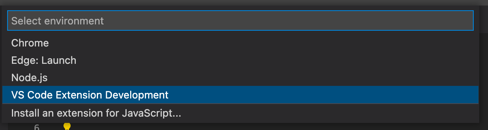

You want to make changes to the syntax highlighting and don't know where to start and how to see the impact of your changes? This document should get you started.

It's a bit clunky. I apologize. There isn't a whole lot of people who write their own syntax highlighting grammars.

 * [Overview](#overview)
 * [Testing in Visual Studio Code](#testing-in-visual-studio-code)
    * [Setup](#setup)
    * [Visual development](#visual-development)
    * [Unit Testing](#unit-testing)
 * [Helpful Resources](#helpful-resources)

## Overview

Much like [microsoft/TypeScript-TmLanguage](https://github.com/microsoft/TypeScript-TmLanguage), the `.tmLanguage` files are maintained in [YAML](https://yaml.org/) to make them easier to consume and edit by humans.

The `*.tmLanguage.json` files are _generated_ by our build and are _not_ maintained manually.

## Testing in Visual Studio Code

### Setup

Visual Studio Code only lets you debug _extensions_, so we'll use [`theme-check-vscode`]() for this. Since this repository is a `git submodule` of `theme-check-vscode`.

1. Clone [theme-check-vscode](https://github.com/Shopify/theme-check-vscode).

  ```sh
  git clone --recurse-submodules https://github.com/Shopify/theme-check-vscode
  ```

  NOTE: If you forgot the `--recurse-submodules` flag, you can fix it with the following command at the root of the `theme-check-vscode` directory:

  ```sh
  git submodule update --init --recursive
  ```

2. Install dependencies

  ```
  cd theme-check-vscode
  yarn install
  ```

### Visual development

1. In a terminal, at the root of `theme-check-vscode`, build the extension:

   ```sh
   cd path/to/theme-check-vscode
   npm run build
   ```

2. Start the YAML->JSON syntax highlighting watcher:

   ```sh
   npm run dev:syntax
   ```

3. In VS Code, at the root of `theme-check-vscode`, open `src/extension.js`.

4. Press `F5` (or Run > Start Debugging menu option).

5. Select the `VS Code Extension Development` option.

  

6. In the `[Extension Development Host]` window, open the `theme-check-vscode/syntaxes/test` folder. Open any `*.liquid` file.

7. In the other window, make modifications to any of the language grammar files (the YAML files).

8. In the `[Extension Development Host]` window, hit `⌘+R` to refresh.

   You should see the result of your changes.

9. Repeat step 7-8 until satisfied.

It is highly recommended you setup [VS Code's Scope inspector](https://code.visualstudio.com/api/language-extensions/syntax-highlight-guide#scope-inspector). This will greatly help you debug your changes.

### Unit Testing

Turns out this is kind of hard to test. The folks at Microsoft have a text-based workflow that involves committing "baseline" outputs for a series of files. We're doing the same here.

1. In a terminal, go into the `theme-check-vscode/syntaxes` folder.

  ```sh
  cd path/to/theme-check-vscode
  cd syntaxes
  ```

2. Make changes to any of the YAML files.

3. Generate new traces:

  ```
  yarn test
  ```

4. Inspect the result of the `theme-check-vsode/syntaxes/test/generated/*.baseline.txt` files.

5. Look at the diff between your changes and the accepted baselines:

  ```sh
  yarn test:diff
  ```

6. Repeat step 2–5 until satisfied.

7. Accept and commit the changes as the new baselines.

  ```sh
  yarn test:accept
  yarn add tests/baselines
  ```

## Helpful Resources

- [Official documentation on TextMate language grammars](https://macromates.com/manual/en/language_grammars#naming_conventions)

  For when you want to learn more about what the fields are and how they work. You should take an afternoon reading this entire page and taking notes. This is going to go a long way.

- [List of convention for scope names](https://www.sublimetext.com/docs/scope_naming.html)

  Don't know what `name` to give to a token so that it gets highlighted properly by default themes? This reference should guide you.

- [Visual Studio Code Syntax Highlighting Guide](https://code.visualstudio.com/api/language-extensions/syntax-highlight-guide)

  * [Scope Inspector Documentation](https://code.visualstudio.com/api/language-extensions/syntax-highlight-guide#scope-inspector)

    This section is particularly helpful when you want to debug interactively and see the result of your changes.

- [Official documentation on TextMate scope selectors](https://macromates.com/manual/en/language_grammars#naming_conventions)

  For when you want to understand styling. It's a bit less important.
